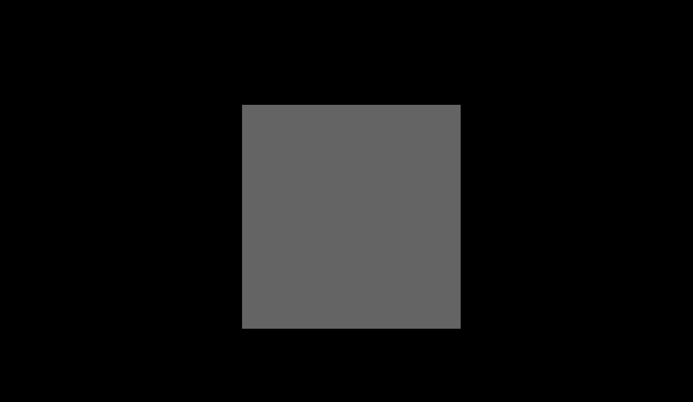

# Using an experimental beam - part 1
**NOTE:** RADDOSE-3D currently only supports [portable graymap (PGM)](http://netpbm.sourceforge.net/doc/pgm.html) file images. Free software such as [GIMP](https://www.gimp.org/) are capable of exporting this type of file. If you would like another image file type to be supported, please [file an issue](https://github.com/GarmanGroup/RADDOSE-3D/issues) on the RADDOSE-3D repository page.

It is possible to run RADDOSE-3D with an experimentally determined beam profile. In this example we'll provide an example where the beam profile is completely tophat so you can see exactly how the experimental beam profile differs from the standard beam profile specification.
Below is an image of a 2D beam profile (We've made this up). You can see that it's a top hat beam - inner square has a pixel values equal to 1 and the background has pixel values equal to zero. An important note here is that the value of the pixels are only relative (they do not correspond to absolute flux values). This is because when the total flux is specified RADDOSE-3D works out how to distribute the flux appropriately across the image. Therefore a pixel with a value of 10 will have double the flux of a pixel with a value of 5.   
   
The above image is 1360 x 790 pixels. In reality the size of the image doesn't tell us anything about the true size of the beam (the image could've been 100 x 100 pixels). Therefore RADDOSE-3D needs to know the **PixelSize**, i.e. how big are the pixels in reality (in micrometers). Here the pixel size is (0.310 microns and 0.336 microns in the y and x directions respectively). With this pixel size the beam area corresponds to a beam size of roughly 140 microns x 140 microns.

The RADDOSE-3D input file for this example  with an insulin crystal is
```
Crystal  # Specification for an insulin crystal
Dimensions 89 74 40
Type Cuboid
CoefCalc RD3D
NumMonomers 8
NumResidues 153
ProteinHeavyAtoms Zn 2 S 6
SolventHeavyConc P 425
UnitCell 78.4 78.4 78.4
SolventFraction 0.6436

Beam
Type Experimentalpgm  # Tell RADDOSE-3D that it should expect an experimental beam
File tophat_beam_experimental.pgm  # location of experimental beam file
PixelSize 0.310 0.336  # Pixel size in microns
Flux 1.9e11
Energy 12.7

Wedge 0 90  # 90 degree rotation
ExposureTime 45  # 45 second exposure
```
Save this in a file of your choice (here we'll call it "MyInput.txt"). **Note**: RADDOSE-3D expects the PGM file to be located in the current working directory. We can then open up a terminal/command prompt, change directory to wherever the RADDOSE-3D executable jar file is located and run:
```
java -jar raddose3d.jar -i path/to/MyInput.txt
```
If you come across an error, namely: `Error accessing element database file constants/MuCalcConstants.txt`, this is likely because RADDOSE-3D hasn't found the `MuCalcConstants.txt` file which it needs to know information about the various elements. To solve this problem:
   - you need to create a folder in your working directory called `constants`.       
   - make a copy of the `MuCalcConstants.txt` file from [here](https://github.com/GarmanGroup/RADDOSE-3D/tree/master/constants) in that folder.    

   This error should only occur when the `CoefCalc` input values are either: `RD3D`, `EXP`, `SAXS`, `SEQUENCE` or `SAXSSEQ`.   
   See the  [Gotchas](https://github.com/GarmanGroup/RADDOSE-3D#gotchas-when-running-raddose-3d) section for notes on how to solve other problems that may arise when running RADDOSE-3D.

For completeness, the equivalent specification of the Tophat beam without an experimental image file is
```
Crystal  # Specification for an insulin crystal
Dimensions 89 74 40
Type Cuboid
CoefCalc RD3D
NumMonomers 8
NumResidues 153
ProteinHeavyAtoms Zn 2 S 6
SolventHeavyConc P 425
UnitCell 78.4 78.4 78.4
SolventFraction 0.6436

Beam
Type Tophat
Flux 1.9e11
Energy 12.7
Collimation Rectangular 140 140

Wedge 0 90  # 90 degree rotation
ExposureTime 45  # 45 second exposure
```
