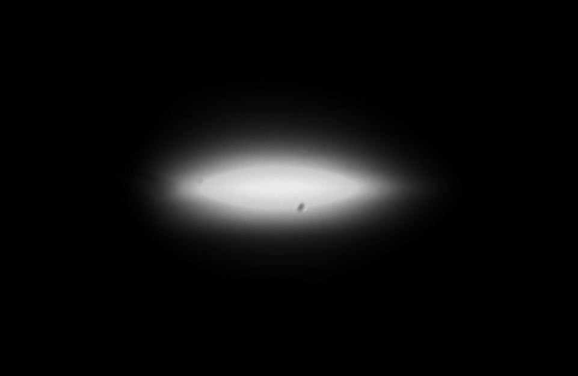

# Using an experimental beam - part 2
**NOTE:** RADDOSE-3D currently only supports [portable graymap (PGM)](http://netpbm.sourceforge.net/doc/pgm.html) file images. Free software such as [GIMP](https://www.gimp.org/) are capable of exporting this type of file. If you would like another image file type to be supported, please [file an issue](https://github.com/GarmanGroup/RADDOSE-3D/issues) on the RADDOSE-3D repository page.

For a full introduction to using an experimental beam profile, see [Part 1]() of this example set.

Here we use an experimentally measured beam profile taken from beamline I02 at Diamond Light Source (this image was previously grey-scaled and converted to a PGM file using [custom scripts that you can access here](https://github.com/JonnyCBB/BeamlineI02work)).
    
This image size is 961 x 625 pixels. The pixel size is 0.3027 microns by 0.2995 microns in the x and y direction respectively. Therefore the beam in the image is roughly a Gaussian beam with an 80 micron by 20 micron full width half maximum (FWHM).

The input file for this beam is:
```
Crystal
Type Cuboid
Dimensions 100 80 60
CoefCalc exp
pdb 1KMT  # Use a PDB for the crystal composition

Beam
Type ExperimentalPGM  # Tell RADDOSE-3D to expect an experimental beam
File beam.pgm  # Tell RADDOSE-3D the name of the file
PixelSize 0.3027 0.2995  # specify the pixel size in microns
Flux 1e12
Energy 12.66


Wedge 0 360
ExposureTime 360
```
Save this in a file of your choice (here we'll call it "MyInput.txt"). **Note**: RADDOSE-3D expects the PGM file to be located in the current working directory. We can then open up a terminal/command prompt, change directory to wherever the RADDOSE-3D executable jar file is located and run:
```
java -jar raddose3d.jar -i path/to/MyInput.txt
```
Make sure you have a good internet connection if you wish to use a PDB code to specify the input. If you come across an error, namely: `Error accessing element database file constants/MuCalcConstants.txt`, this is likely because RADDOSE-3D hasn't found the `MuCalcConstants.txt` file which it needs to know information about the various elements. To solve this problem:
   - you need to create a folder in your working directory called `constants`.       
   - make a copy of the `MuCalcConstants.txt` file from [here](https://github.com/GarmanGroup/RADDOSE-3D/tree/master/constants) in that folder.    

   This error should only occur when the `CoefCalc` input values are either: `RD3D`, `EXP`, `SAXS`, `SEQUENCE` or `SAXSSEQ`.   
   See the  [Gotchas](https://github.com/GarmanGroup/RADDOSE-3D#gotchas-when-running-raddose-3d) section for notes on how to solve other problems that may arise when running RADDOSE-3D.
