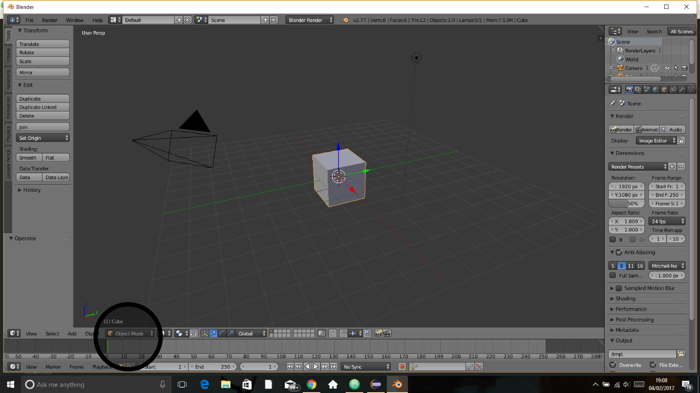
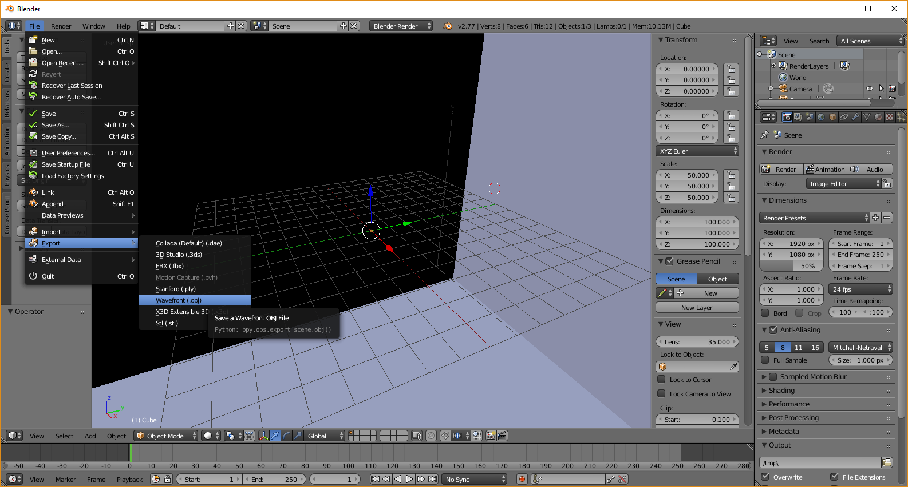
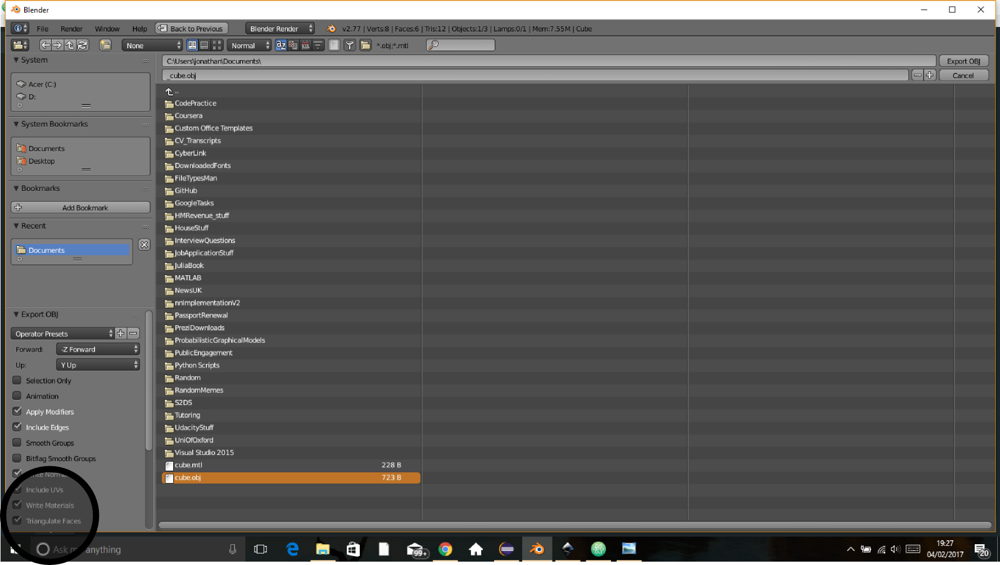

# Using arbitrary geometry file

#### Cube example
RADDOSE-3D allows the user to specify any arbitrary shaped sample to simulate in a diffraction experiment (not just cuboids, spheres and cylinders). In this example we'll create a cuboid shaped crystal using a geometry file and compare this to how we typically generate a cuboid crystal in RADDOSE-3D

The easiest way to create an arbitrary shape is to mode the shape you want using [Blender](https://www.blender.org/) which is a "free and open source 3D creation suite." [Download](https://www.blender.org/download/) and open Blender. In the bottom left of the screen you should see that you're in *object mode* (black circle in the figure below), if not then change it to *object mode*.

Press **N** on the keyboard and this should open the *Transform* tab. we're going to make a cube which is 100 x 100 x 100 micrometers^3 so in the *Dimensions* fields change the x, y and z dimensions to 100 (the object will look super massive on screen). Now we can export the object to a *Wavefront (.obj)* (see screenshot below). For more information on the [Wavefront .obj file format see below](#Wavefront-obj-file)).   
    
Before exporting the file ensure that you check the **Triangulate Faces** box in the bottom left corner (black circle in the image below). This is required because RADDOSE-3D assumes that the 3D object (polyhedron) is composed of triangular faces. This does not affect the generality of the 3D objects that can be used in RADDOSE-3D because every polyhedron can be composed using triangular faces.     
Let's name our obj file `cube.obj` and save this in the current working directory.
    
[Blender](https://www.blender.org/) also writes a [*material library (.mtl) file*](http://www.fileformat.info/format/material/) to the same directory but RADDOSE-3D does not use this file at all so it can be discarded.

Now we can run RADDOSE-3D using the cube.obj file to define the 3D geometry. This is done using the file input below
```
Crystal
Type Polyhedron  # Polyhedron crystal definition
Wireframetype obj  # The type of geometry file being used
ModelFile cube.obj  # The name of the geometry file
PixelsPerMicron 1
CoefCalc exp # Tell RADDOSE-3D to expect a PDB code
pdb 1KMT
SolventHeavyConc Na 100

Beam
Type Tophat
Flux 1e12
Energy 12.66
Collimation Rectangular 50 50

Wedge 0 0  # No rotation
ExposureTime 30
```
Save this in a file of your choice (here we'll call it "MyInput.txt"). We can then open up a terminal/command prompt, change directory to wherever the RADDOSE-3D executable jar file is located and run:
```
java -jar raddose3d.jar -i path/to/MyInput.txt
```
If you come across an error, namely: `Error accessing element database file constants/MuCalcConstants.txt`, this is likely because RADDOSE-3D hasn't found the `MuCalcConstants.txt` file which it needs to know information about the various elements. To solve this problem:
   - you need to create a folder in your working directory called `constants`.       
   - make a copy of the `MuCalcConstants.txt` file from [here](https://github.com/GarmanGroup/RADDOSE-3D/tree/master/constants) in that folder.    

   This error should only occur when the `CoefCalc` input values are either: `RD3D`, `EXP`, `SAXS`, `SEQUENCE` or `SAXSSEQ`.   
   See the  [Gotchas](https://github.com/GarmanGroup/RADDOSE-3D#gotchas-when-running-raddose-3d) section for notes on how to solve other problems that may arise when running RADDOSE-3D.

Also note that if you run a simulation where you have used a PDB entry to specify the sample composition (as above) but you don't specify any solvent heavy atoms you'll get the following error: `Exception in thread "main" java.lang.NullPointerException`. This is because RADDOSE-3D is expecting you to specify the heavy solvent concentration using the `SolventHeavyConc` keyword. **This is a bug!** This will be fixed for the next release but for now the workaround is to add the following to the input file if you don't have any heavy solvents: `SolventHeavyConc Na 0`

The analogous input using the predefined cuboid geometry in RADDOSE-3D is
```
Crystal
Type Cuboid
Dimensions 100 100 100
PixelsPerMicron 0.5
CoefCalc exp
pdb 1KMT
SolventHeavyConc Na 100

Beam
Type Tophat
Flux 1e12
Energy 12.66
Collimation Rectangular 50 50

Wedge 0 0
ExposureTime 30
```

#### Wavefront obj file
This is a [geometry definition file format](https://en.wikipedia.org/wiki/Wavefront_.obj_file) that RADDOSE-3D uses to define the 3D object to be irradiated in the diffraction simulation. The lines in the file that begin a `v` correspond to the object's vertices and defines the 3D shape. The lines that begin with `f` correspond to the connectivity of the vertices and this allows RADDOSE-3D to work out whether the X-ray beam intersects the crystal or not. **NOTE:** this implementation was written when the obj files only wrote the [vertex indices](https://en.wikipedia.org/wiki/Wavefront_.obj_file#Vertex_Indices) for the `f` lines. Now [Blender](https://www.blender.org/) writes [vertex normal indices without texture coordinate indices](https://en.wikipedia.org/wiki/Wavefront_.obj_file#Vertex_Normal_Indices_Without_Texture_Coordinate_Indices) by default so RADDOSE-3D only reads the vertex index from the `f` lines.
